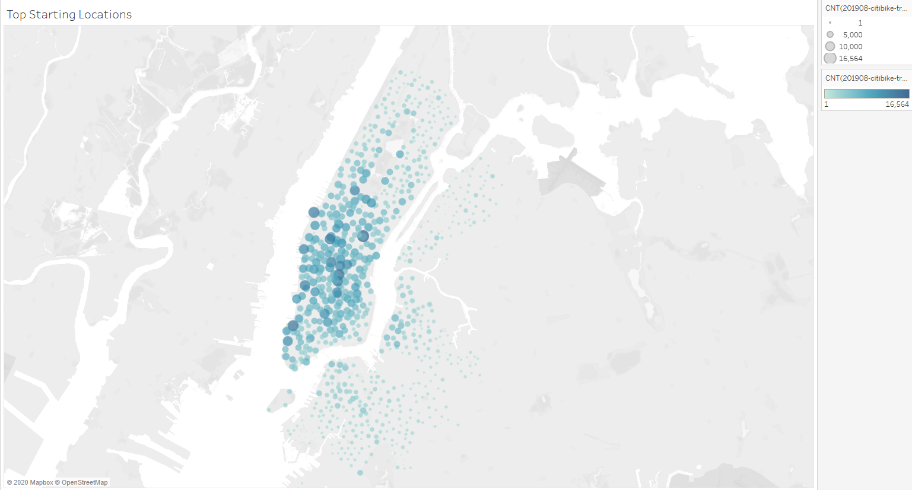
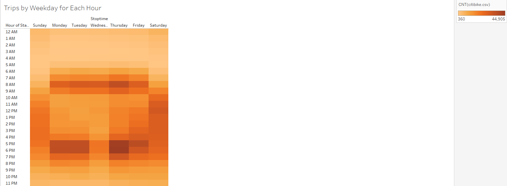
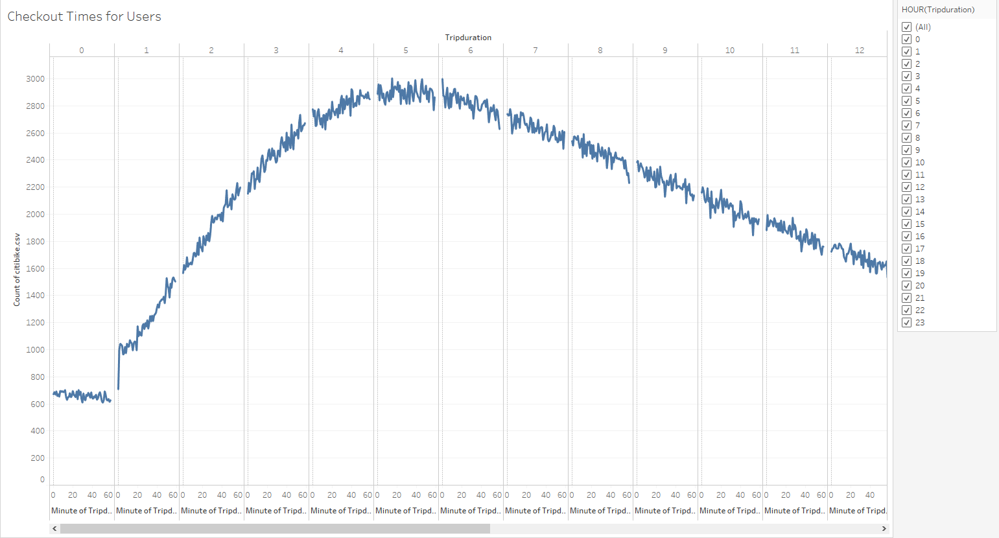
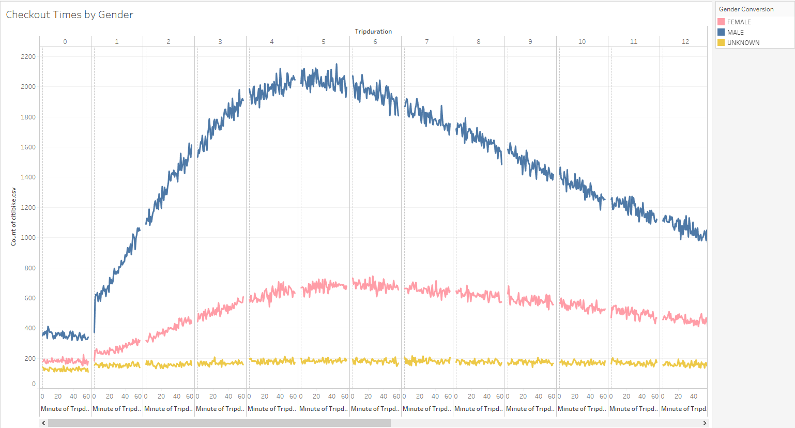
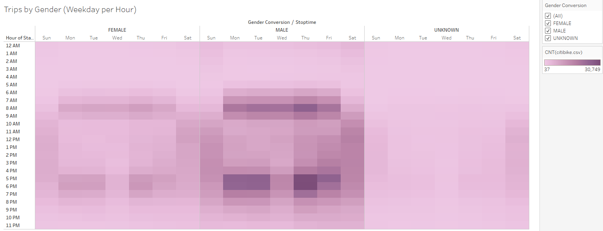
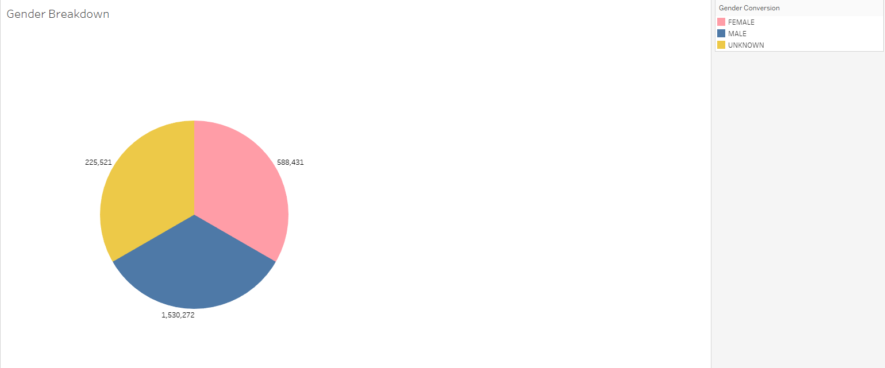
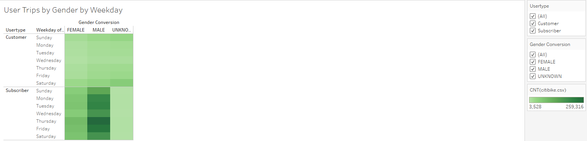

# NYC-Citibike

## Overview of the analysis: 
We are analyzing the Citibike rental in NYC to confirm if it will be a good business to bring to De Moines, IA. 

## Results: 
Our Tableau Story for the bike-share rental analysis : [NYC Citibike Story](https://public.tableau.com/profile/andy.feng6957#!/vizhome/ModuleChallenge14/NYCCitibikeStory?publish=yes)

### Top Starting Locations

- We can see that a amount of ridesharers start in midtown Manhattan
### Breakdown of Tripduration over the Week

- Majority of the rentals start early morning and early evening on weekdays, and afternoon on weekends

- Majority of the ridesharers begin checking out the bike between 4:00am to 6:00am

### Breakdown by Gender

- Majority of the ridesharers are men

- The number of men who uses Citibike nearly triples that of women riders.

- majority of the subscribers who uses Citibike throughout the week seem to be men

## Summary:

We can conclude that majority of the rides were ridden on weekday most likely for commute to work. Therefore, it would be best advised to promote the program in the inner part of the city closer to offices.

For addiitonal data, we can find the average ages group using the citibike rental program. We can determine if they are university age or working age adults who use it the most.
Lastly, we can also confirm with subscriber addresses. We can determine if the citibike program is mainly used by locals or toursits.
